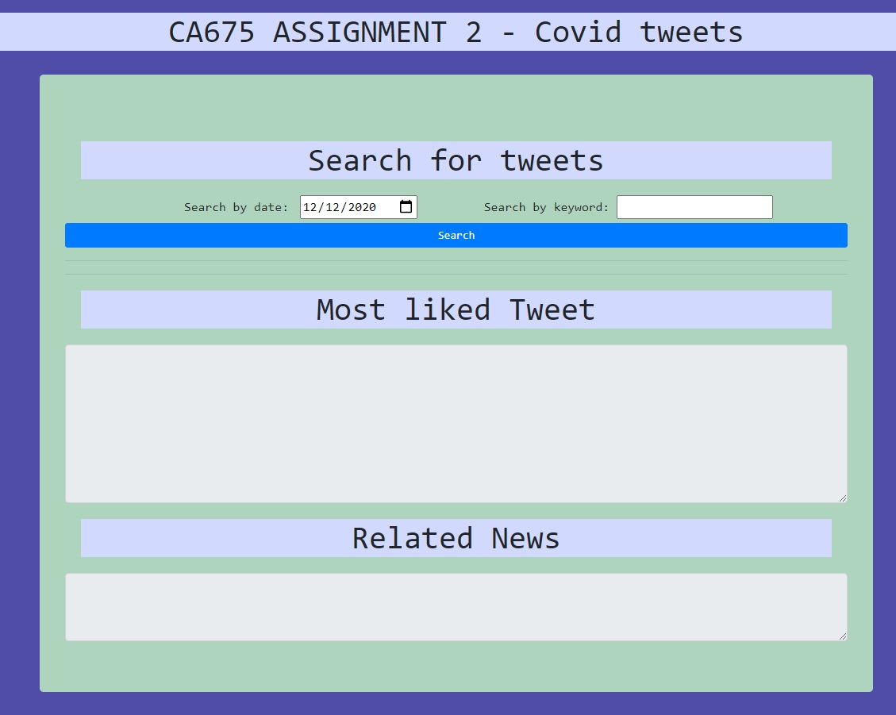

# CA675-assignment2

This is a web application created using Flask and deployed on a hadoop cluster to process a large dataset.

This application can currently be found here:
 
<a href="http://34.76.77.144/">http://34.76.77.144/</a>

